# GETPLACE

## Insights Engine для экспансии ресторанных сетей

**6 630 opportunities  •  8 источников данных  •  7 AI-агентов  •  149 Act Now**

*Как пересечение 8 государственных источников создаёт инсайты, которые невозможно получить из одного*

Внутренняя презентация • Март 2026 • Vitaly Pokrovskiy, CTO

---

## 1. Три инсайта, которые невозможно получить вручную

| Локация | Факт | Что видит бренд | Что видит Getplace |
|---------|------|-----------------|-------------------|
| Custom House, London | 9.8M пассажиров/год | «Станция DLR где-то на востоке» | Score 75: 5 брендов отсутствуют, 48 bus stops, A13 — 109K авто/день. Один Subway на 9.8M человек |
| M25 у Heathrow | 210K авто/день | «Загруженная дорога» | Score 94: ноль drive-thru в 1.5 км. 210K машин проезжают мимо пустоты |
| City of London | 88 923 работника | «Бизнес-район» | Score 82: 89K обедают, 8.6K живут. Рестораны смотрят на жителей — и не видят 10× спроса |

Три инсайта. Три типа возможностей. Ни один невозможен из одного источника данных.

Каждый создан на пересечении 5–8 государственных датасетов — пассажиропоток, автотрафик, демография, рабочее население, автобусные остановки, локации конкурентов. Expansion manager тратит 2–4 недели, чтобы проанализировать ОДНУ точку вручную. Getplace выдаёт 6 630 таких оценок за 10 секунд.

Результат: 6 630 scored opportunities — 517 станций + 5 000 перекрёстков + 1 113 зон. Каждая с прозрачным разбором сигналов, cited evidence и AI-рекомендацией.

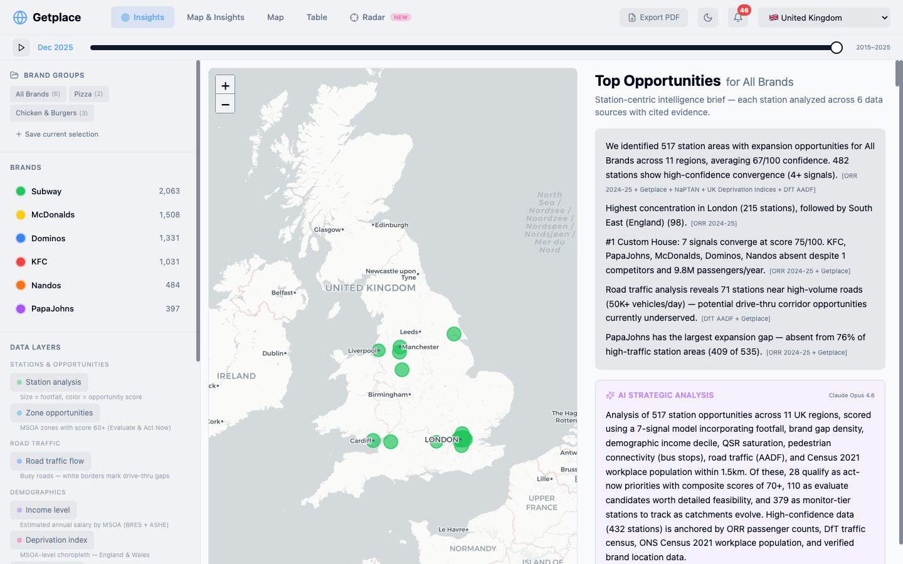

---

## 2. Почему это важно: рынок и цена ошибки

### Масштаб рынка

Рынок QSR в Великобритании — £28,5 млрд (2025), рост 5,2% ежегодно. ~50 000 заведений, из них сетевые операторы занимают 59% рынка. Ежегодно сети открывают ~1 200 новых точек, а 35% QSR-операторов планируют открытие новых локаций в ближайшем году (Mordor Intelligence, IBISWorld).

### Цена ошибки

Открытие одной точки QSR стоит от £350K (McDonald's) до £2.5M (KFC). 60% ресторанов закрываются в первый год. Неправильный выбор локации — причина №1 провалов. С 2022 по 2024 год в UK ежегодно закрывалось ~91 500 ресторанов (Kalibrate). Даже одна ошибка обходится бренду в сотни тысяч фунтов прямых потерь.

### Как сегодня выбирают локации vs. с Getplace

| | До (Expansion Manager сегодня) | После (с Getplace) |
|---|---|---|
| **Данные** | 2–3 источника: свои продажи, Google Maps, консалтинг за £50K | 8 гос. источников + все конкуренты, автообновление |
| **Охват** | 5–10 «знакомых» локаций в квартал | 6 630 scored opportunities по всей UK за 10 секунд |
| **Конкуренты** | «Мне кажется, здесь есть KFC» | Координаты 6 820 ресторанов, proximity 400/800/1500м |
| **Трафик** | Ощущение «тут много машин» | 46K точек DfT: 210K авто/день на M25, 0 drive-thru в 1.5км |
| **Обоснование** | Презентация на 20 слайдов: «мы верим в эту локацию» | 7 сигналов с cited evidence: ORR, NaPTAN, DfT, Census, IMD |
| **Скорость** | 2–4 недели на одну локацию | 10 секунд на 6 630 локаций. Deep dive — один клик |
| **Упущенные возможности** | Невидимы. Custom House не попадёт в shortlist | Система находит ВСЕ: 149 «Act Now» с score 80+ |
| **Стоимость ошибки** | £200K–£1.85M на неудачную локацию | Прозрачный скоринг снижает риск. Каждый сигнал — проверяемый факт |

### ROI: окупаемость с первого решения

| Категория | Без Getplace | С Getplace | Экономия |
|-----------|-------------|------------|----------|
| Время на анализ 1 локации | 2–4 недели | 10 секунд | 99.9% времени |
| Стоимость аналитика | £2 000/мес (5 дней × £400/день) | £0 (автоматизировано) | £24K/год |
| Покрытие анализа | 5–10 локаций/квартал | 6 630 за 10 секунд | 660× больше |
| Риск ошибки | £200K–£1.85M на локацию | Снижение 10–20% | £20K–£370K на решение |
| Источники данных | 1–3 (свои + Google Maps) | 8 государственных + Getplace | Уникальная конвергенция |

**Итого за год** (клиент с 10+ новыми локациями): прямая экономия £24K (аналитик) + £200K–£3.7M (снижение риска). ROI при подписке £30–50K/год: **5–80× return**.

---

## 3. Кейс: «Drive-thru пустыня» — M25 и M60

### Проблема

Drive-thru — самый быстрорастущий сегмент QSR (7,2% CAGR). В US drive-thru генерирует 50%+ выручки; в UK тренд активно растёт. Greggs открыл 207 новых точек в 2025 году, KFC планирует 500 новых к 2034, Popeyes открывает ~1 ресторан в неделю. Но где именно размещать drive-thru?

### Что нашла система

Junction scoring нашёл массовый паттерн: на самых загруженных дорогах UK практически нет drive-thru:

| Дорога | Трафик (авто/день) | Drive-thru в 1.5км | QSR в 1.5км | Score |
|--------|-------------------|-------------------|-------------|-------|
| M25 (Heathrow) | 210 436 | 0 | 1 | 94 |
| M60 (Manchester) | 192 025 | 0 | 0 | 90 |
| M25 (Hertfordshire) | 185 136 | 0 | 0 | 90 |
| M1 (Luton) | 179 502 | 0 | 0 | 89 |
| M42 (West Midlands) | 167 419 | 0 | 0 | 89 |
| M62 (Yorkshire) | 165 097 | 0 | 0 | 88 |
| M6 (West Midlands) | 172 000 | 0 | 0 | 88 |

Из 5 000 высокотрафиковых сегментов дорог: **3 095 (62%) имеют ноль drive-thru в 1.5км.** 149 сегментов набрали ≥80 баллов — это first-mover corridor opportunities.

Этот инсайт невозможен без пересечения DfT AADF (дорожный трафик) + Getplace (drive-thru локации). DfT публикует трафик, но никто не cross-reference-ил с локациями drive-thru. Первый бренд, занявший эти точки, получает first-mover advantage на 3–5 лет.

### Demand Evidence — 5 источников

| Demand Evidence | Источник |
|----------------|----------|
| M25 у Heathrow: 210 436 авто/день | GOV  DfT AADF 2024 |
| 0 drive-thru в 1.5км от топ-перекрёстка | GP  Getplace |
| 3 095 из 5 000 сегментов (62%) — ноль drive-thru | CROSS  DfT × Getplace |
| Drive-thru — самый быстрорастущий формат QSR (7,2% CAGR) | Industry  QSR Magazine |
| Greggs: 207 новых в 2025, KFC: 500 план к 2034 | Industry  Company filings |

### Risks & Caveats

| Риск | Тип | Комментарий |
|------|-----|-------------|
| Близость к автомагистрали ≠ удобный съезд | CROSS | Не все высокотрафиковые сегменты имеют удобные развязки/съезды |
| Planning permission для drive-thru | Regulatory | Местные органы могут ограничить строительство drive-thru у магистралей |
| AADF — среднегодовой, сезонность не учтена | Data | Летний/праздничный трафик может отличаться от среднего |

### Deep Dive: M25 South East — Score 94, #1 в рейтинге

Система показывает не только список — а полный deep dive по каждому перекрёстку. M25 у Egham (South East) — перекрёсток #1 с максимальным скором:

| Метрика | Значение | Контекст |
|---------|----------|----------|
| Daily Traffic | 196K авто/день | top 0% nationally |
| Drive-Thru Nearby | 0 | ноль в 1.5км |
| QSR Nearby | 4 | спрос подтверждён |
| Confidence | high | 4 из 4 сигналов |

| Сигнал | Значение | Tier | Детали |
|--------|----------|------|--------|
| Traffic volume | 196K vehicles/day | Very Strong | top 0% — один из самых загруженных в UK |
| Drive-thru gap | 0 в 1.5км | Very Strong | Полностью пустой коридор |
| QSR presence | 4 QSR в 1.5км | Strong | Коммерческий спрос валидирован |
| Demographic fit | Income matches brand | Strong | Уровень дохода соответствует |

4 из 4 сигналов сработали — максимальный confidence bonus. Особенность: 4 QSR уже работают рядом (sit-down формат), но ни одного drive-thru. Спрос подтверждён наличием конкурентов — но формат drive-thru не занят.

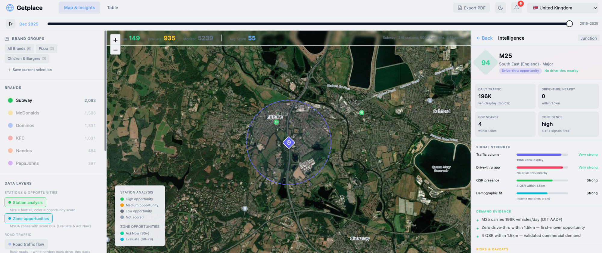

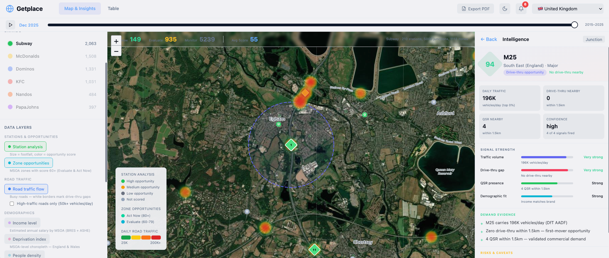

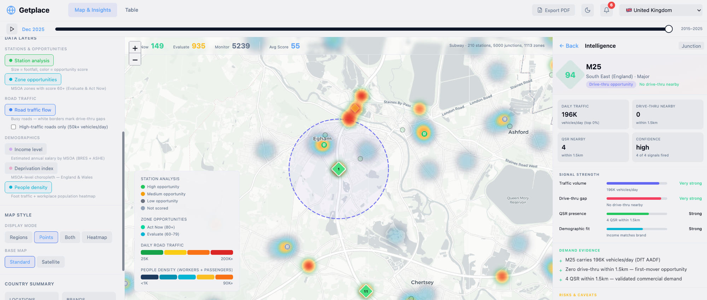

---

## 4. Кейс: 9.8 миллионов пассажиров, один Subway

Custom House — станция DLR/Elizabeth Line рядом с ExCeL London. 9.8M пассажиров в год (top 10% nationally). Но: всего 1 QSR в радиусе 800м (один Subway). Ни McDonald's, ни KFC, ни Domino's, ни Nando's, ни Papa John's.

Score: 75/100, 7 из 7 сигналов сработали — одна из немногих станций в UK с полным набором сигналов (confidence bonus +25%):

| Сигнал | Значение | Tier | Детали |
|--------|----------|------|--------|
| Footfall | 9.8M pax/yr | Moderate | Top 10% nationally |
| Brand Gap | 5 gaps | Strong | KFC absent, 1 competitor within 800m |
| Demo Fit | Decile 2 | Very Strong | Value brand match |
| Low Density | 1 QSR | Moderate | 1 QSR vs avg 3 |
| Pedestrian | 48 bus stops | Moderate | Top 38% |
| Road Traffic | A13 — 109K/day | Strong | 1 drive-thru nearby |
| Workforce | 26K workers | Strong | Business district |

### AI-рекомендация

> *"The convergence of DLR/Elizabeth line rail access, the A13 at 109K vehicles/day, and proximity to ExCeL London creates a unique multi-modal demand profile with only 1 QSR currently serving 9.8M annual passengers."*
> — AI Recommendation, Claude Opus 4.6

> *"Demand is partially event-driven via ExCeL London, so model revenue with and without major exhibitions to ensure the base case (9.8M rail passengers plus A13 road traffic) supports the unit independently. The ongoing Royal Docks development pipeline will increase the permanent residential and worker population over the next 3–5 years."*
> — AI Risk Warning

### Demand Evidence — 5 источников, каждый проверяемый

Система не просто показывает скор — она приводит доказательства спроса с указанием конкретного государственного источника для каждого факта:

| Demand Evidence | Источник |
|----------------|----------|
| 9.8M passengers/year — top 10% nationally | GOV  ORR Station Usage 2024-25 |
| 48 bus stops within 800m — top 38% for pedestrian activity | GOV  NaPTAN |
| A13 nearby — 109K vehicles/day, 1113m away | GOV  DfT AADF |
| 1 QSR competitor already present — validates commercial demand | GP  Getplace |
| 26K workers within 1.5km — business district with strong lunchtime demand | GOV  Census 2021 WP001 |

Каждый факт помечен GOV (государственный источник) или GP (Getplace). Это не «мы думаем» — это «данные говорят». Expansion manager может проверить каждую цифру на сайте источника.

### Risks & Caveats

| Риск | Тип | Комментарий |
|------|-----|-------------|
| Спрос частично event-driven (ExCeL London) | CROSS | Моделировать выручку без выставок |
| London локация — premium rental costs | CROSS | Учесть в финмодели |

**Data completeness: 100%** (7 из 7 сигналов сработали, все источники доступны). Не каждая станция набирает 100% — если для района нет данных о зарплатах или трафике, система честно показывает пробелы.

### Потенциальная выручка

При конверсии 0.5% из 9.8M пассажиров и среднем чеке £7 — **~£343K/год**. Бренды в 800м: Subway (присутствует, 1), KFC (gap), PapaJohns (gap), McDonalds (gap), Dominos (gap), Nandos (gap) — 5 из 6 брендов отсутствуют.

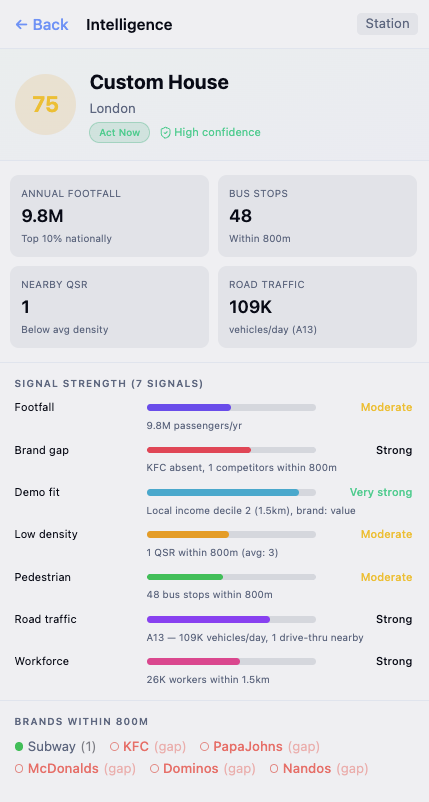

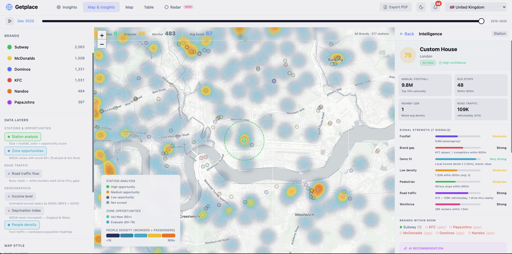

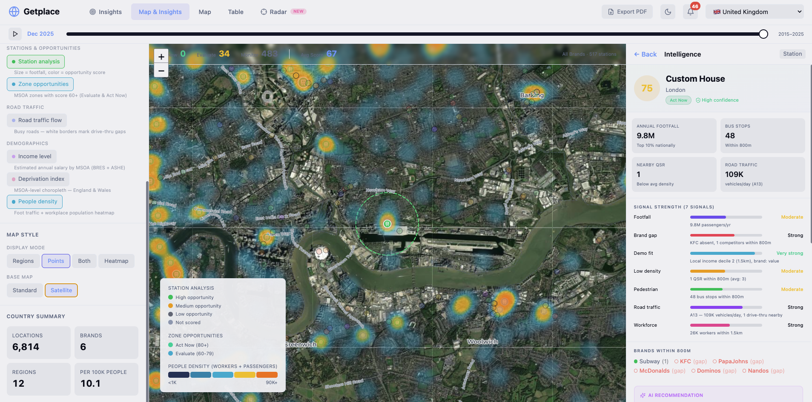

---

## 5. Кейс: 89 000 обедают, 8 600 живут

Бренды, выбирающие локации по данным о населении, систематически пропускают зоны с обеденным трафиком. Известные хотспоты предсказуемы:

| Зона | Работники | Жители | Ratio | Ближайшая станция |
|------|-----------|--------|-------|-------------------|
| City of London 001 | 88 923 | ~8 600 | 10.3× | Liverpool Street (98M pax) |
| Westminster 018 | ~75 000 | ~12 000 | 6.3× | Victoria (54M pax) |
| Tower Hamlets 033 | ~60 000 | ~15 000 | 4.0× | Canary Wharf (16M pax) |

City of London, Westminster, Canary Wharf — это очевидные зоны. Любой expansion manager назовёт их без системы. Но система находит и неочевидные.

### Но система находит и неочевидные зоны

Zone London #668 — район рядом с Wimbledon. 5 000 работников, ни одного QSR в радиусе 1.5км. **Ноль.** Шесть брендов из шести отсутствуют. Эту зону невозможно найти, глядя только на данные о населении — она становится видимой только на пересечении Census WP001 + Getplace QSR + ORR.

Score: 72/100, тип Area opportunity, 4 сигнала, high confidence:

| Метрика | Значение | Источник |
|---------|----------|----------|
| Workplace Pop | 5 000 | Census 2021 WP001 |
| QSR Nearby | 0 (ноль) | Getplace |
| Brand Gaps | 6 из 6 | Getplace |
| Ближайшая станция | Raynes Park, 0.2км | ORR Station Usage 2024-25 |

| Сигнал | Значение | Tier | Детали |
|--------|----------|------|--------|
| Brand gap | 6 из 6 брендов отсутствуют | Very Strong | Ни одного конкурента в 1.5км |
| QSR density gap | 0 QSR в 1.5км | Very Strong | Полностью необслуженная территория |
| Demographic fit | Income matches brand | Strong | Уровень дохода соответствует QSR |
| Workforce | 5K workers | Moderate | Пороговое значение для зоны |
| Footfall proximity | Raynes Park 0.2км | Very Strong | 3M pax/yr в шаговой доступности |

### Demand Evidence — 3 источника, каждый проверяемый

| Demand Evidence | Источник |
|----------------|----------|
| Ноль QSR в радиусе 1.5км — полностью необслуженная зона | GP  Getplace |
| Станция Raynes Park в 0.2км — 3M pax/yr | GOV  ORR Station Usage 2024-25 |
| 5 000 работников в зоне (Census 2021) | GOV  Census 2021 WP001 |

### Risks & Caveats

| Риск | Тип | Комментарий |
|------|-----|-------------|
| Умеренное рабочее население (5K) — может не обеспечить standalone QSR | CROSS | Оценить дополнительный трафик от Raynes Park (3M pax) |
| 6 из 6 брендов отсутствуют — зона может не иметь коммерческой инфраструктуры | CROSS | Проверить наличие коммерческих площадей на месте |

**Пересечение источников:** этот инсайт требует одновременно Census WP001 (рабочее население) + Getplace (QSR локации) + ORR (пассажиропоток станции). Ни один из этих источников по отдельности не показывает эту возможность — только их пересечение создаёт инсайт.

Zone scoring находит **1 113 таких зон по всей UK** — это lunchtime goldmine, который невозможно увидеть из данных о населении (Census residential).

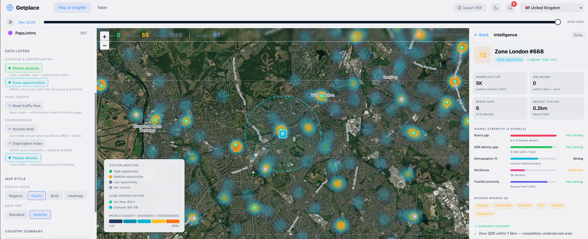

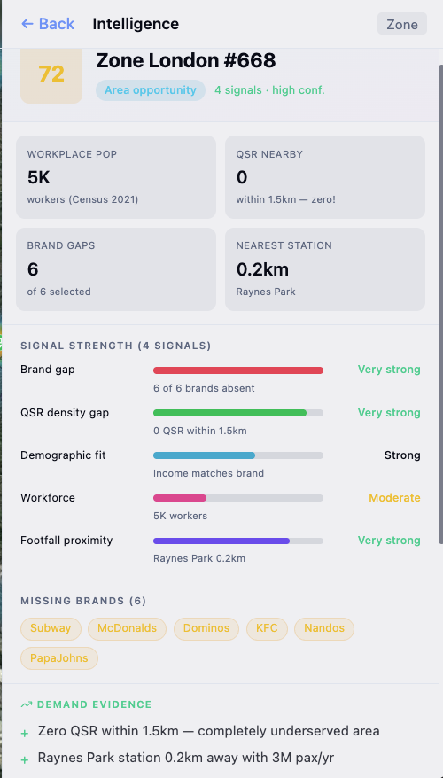

---

## 6. Как работает Getplace: 3 типа возможностей

Три типа точек привязки, каждый со своей моделью, объединённые в один ранжированный список. Все дают скор 0–100 и полностью сопоставимы.

| Тип | Кол-во | Сигналы | Пример инсайта |
|-----|--------|---------|----------------|
| Станции (ж/д) | 517 | 7: пассажиропоток, brand gap, демография, плотность QSR, пешеходы, трафик, рабочие | Custom House: 9.8M pax, 1 QSR, score 75 |
| Перекрёстки (drive-thru) | 5 000 | 4: трафик, drive-thru gap, QSR наличие, демография | M25: 210K авто/день, 0 drive-thru, score 94 |
| Рабочие зоны (MSOA) | 1 113 | 4: рабочее население, QSR gap, демография, близость станции | City of London: 89K работников, 8.6K жителей |

### Конвергенция сигналов: почему это важно

Один сигнал — это гипотеза. Четыре сигнала, совпадающих в одной точке — это убедительное доказательство. Система начисляет confidence bonus: +5% за каждый сигнал сверх минимума.

| Сигналов | Confidence | Bonus | Пример | Действие |
|----------|-----------|-------|--------|----------|
| 2 | Low | ×1.00 | Пассажиропоток + brand gap | Мониторить |
| 3 | Medium | ×1.05 (+5%) | + демография | Изучить |
| 4+ | High | ×1.10–1.25 | + пешеходы + трафик + рабочие | Act Now — осмотр площадки |

Custom House набрал 7 из 7 сигналов — это редкость. Base score 60 × 1.25 bonus = 75/100. **~20% всех opportunities имеют 4+ сигналов** (high confidence) — это локации, которые стоят личного осмотра.

### Источники данных: 8 соурсов, все бесплатные

Ни один из этих источников по отдельности не отвечает на вопрос «где открывать». Только их пересечение создаёт инсайт. Все данные под Open Government Licence v3.0.

| Источник | Что даёт | Объём |
|----------|---------|-------|
| ORR (Office of Rail & Road) | Пассажиропоток ж/д станций | 2 361 станция |
| NaPTAN (реестр остановок) | Координаты + плотность автобусных остановок | 434K остановок |
| DfT (Департамент транспорта) | Автомобильный трафик (AADF) | 46K точек → 5K топ |
| Индексы депривации (4 нации) | Уровень благосостояния по микро-зонам | 43 535 микро-зон |
| Census 2021 WP001 | Рабочее население по районам | 7 264 зоны |
| BRES + ASHE | Занятость и зарплаты по отраслям | 348 районов × 19 отраслей |
| Getplace (собственные) | Локации ресторанов 6 брендов | 6 820 точек |

Вычислительный масштаб: 17.6 млн пар «станция–ресторан» + 960 млн пар «станция–автобусная остановка». Руками это заняло бы ~15 лет аналитической работы.

---

## 7. 7 AI-агентов: автоматический поиск паттернов

Каждый агент отвечает на вопрос, который expansion manager задаёт ежедневно. Раньше каждый ответ требовал 2 недели ручного анализа. Теперь все 7 ответов генерируются одновременно для всех 6 630 opportunities.

| Агент | Вопрос бизнеса | Пример найденного инсайта | Действие |
|-------|---------------|--------------------------|----------|
| Human Flow | Где люди ходят, но нет QSR? | Canada Water: 18.7M pax/yr, 1 QSR в 13 мин ходьбы | Проверить доступность аренды |
| Market Fit | Кому подходит этот район? | Nando's недопредставлен в East Midlands при income decile 5 | Рассмотреть для экспансии |
| Opportunity Engine | Где сходятся все сигналы? | Custom House: 7 сигналов, score 75 | Top priority для site visit |
| Market Monitor | Что изменилось на рынке? | Subway закрыл 12 в Шотландии, Domino's открыл 8 на востоке | Скорректировать стратегию |
| Competitor Tracker | Кто доминирует? | Subway: 35.4% доля в North East | Оценить риск входа |
| Expansion Scout | Куда расти? | Northern Ireland: Hot (score 85) для KFC | Добавить в pipeline |
| Delivery Intel | Как доставлять? | South West: 30% third-party delivery | Партнёрство с агрегаторами |

**~46 инсайтов за один прогон.** Все цитируют конкретные источники данных (ORR, DfT, Census). Это не инструмент для анализа — это готовые ответы с доказательной базой.


---

## 8. Getplace vs конкуренты

Мировой рынок location intelligence — $24.7 млрд (2025), рост 16.8% ежегодно. **Конкуренты продают данные. Getplace продаёт ответ.**

| Возможность | Getplace | Placer.ai | SiteZeus | CACI / Experian |
|-------------|----------|-----------|----------|-----------------|
| Фокус | QSR-специализация | Общий ритейл | Общий ритейл | Демография |
| Конвергенция источников | 8 → scored list | Foot traffic | Foot traffic + демо | Демография |
| Drive-thru gap analysis | ✓ (5 000 сегментов) | ✗ | ✗ | ✗ |
| Workplace vs residential | ✓ (Census WP001) | ✗ | ✗ | ✗ |
| Scored opportunity list | 6 630 ranked 0–100 | ✗ | Частично | ✗ |
| AI-рекомендации | 7 агентов, 46 инсайтов | ✗ | Базовые | ✗ |
| Прозрачность | 7 сигналов с tier + detail | Black box | Частично | N/A |
| Подход | «Где открывать и почему» | «Сколько людей проходит» | «Хороша ли эта точка» | «Кто живёт рядом» |

**Ключевое отличие:** конкуренты продают данные — трафик, демографию, POI. Getplace продаёт ответ: «Открывайте здесь, потому что сходятся 7 сигналов из 8 государственных источников. Score: 95/100.»

---

## 9. Что дальше

### 9.1 Реализовано

- ✅ 6 820 ресторанных локаций 6 брендов
- ✅ 2 361 станция с 7-сигнальным скорингом (517 с порогом ≥1M пассажиров)
- ✅ 5 000 точек трафика с drive-thru gap analysis
- ✅ 1 113 зон с workforce density scoring
- ✅ 43 535 микро-зон с нормализованной демографией 4 наций
- ✅ 7 AI-агентов, 17 типов инсайтов
- ✅ Smart Map с Intelligence Panel (progressive disclosure)
- ✅ Executive Brief с AI Strategic Analysis (Claude Opus 4.6)

### 9.2 Следующие шаги

- **Мультистрановость:** BK уже клиент в UK + Германия. ETL pipeline параметризован: новая страна = 2–4 недели настройки. Далее: Франция, Испания
- **LLM-агенты:** Переход от rule-based к LLM-powered agent insights — более глубокий анализ паттернов
- **API:** REST API для интеграции с Tableau, Looker, BI-платформами — инсайты в существующих рабочих процессах
- **Predictive:** Прогноз выручки по локации (ML model на historical data) — от «где открывать» к «сколько заработаем»

### 9.3 Business Impact

| Метрика | Ожидаемый эффект |
|---------|-----------------|
| Прямая экономия | £24K/год (замена 5 дней/мес аналитической работы) |
| Снижение риска | £20K–£370K на каждом решении (при снижении риска на 10–20%) |
| New customer conversion | +15–20% конверсия на Professional (новый killer feature) |
| Churn reduction | -1–2pp (стикинг-фактор: alerts + weekly reviews) |
| Expansion revenue | +£200–400/мес на клиента (country add-ons) |

### 9.4 Известные ограничения (честно)

| Ограничение | Влияние | Митигация |
|-------------|---------|-----------|
| Census 2021 (workplace pop) | Remote work изменил паттерны | 6 из 8 источников обновляются ежегодно. BRES provisional 2024 уже доступен |
| Зарплата на уровне LA | Все районы в одном LA = одна зарплата | Более гранулярные данные ASHE |
| Шотландия нет в WP001 | Нет zone scoring | Census Scotland покрытие |
| Brand affinity — эвристика | Premium/value может не совпадать | Валидировать с клиентами |

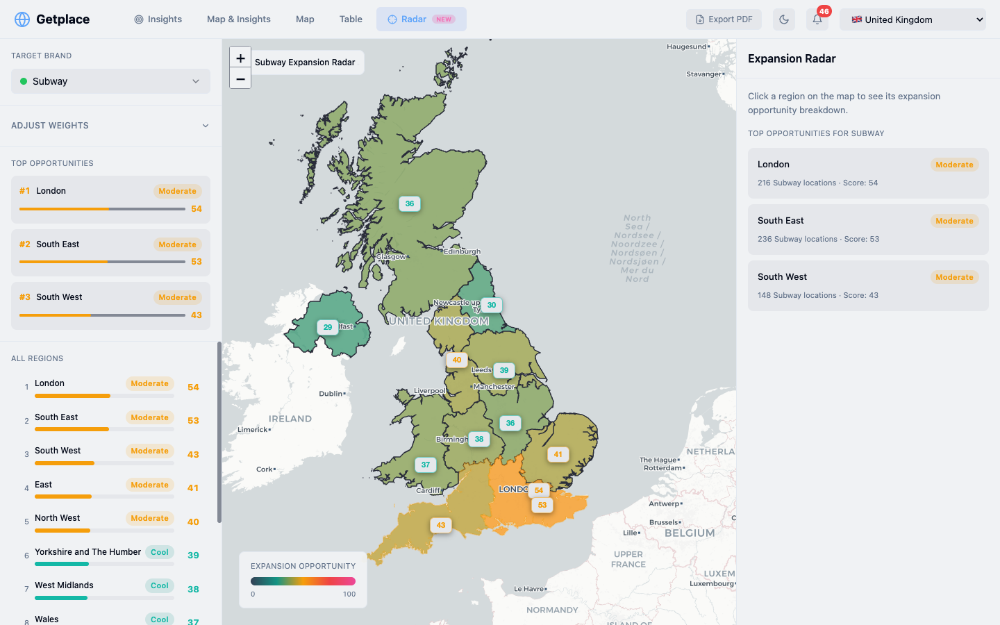

---

## Приложение: Технические детали

### Pipeline от CSV до инсайта

```
RAW DATA (8 sources, ~500K записей)
  ↓ 13 Python ETL scripts (fuzzy matching, haversine, aggregation)
TYPESCRIPT DATA (5 файлов, ~2.3 MB)
  ↓ 3 Scoring Engines (station/junction/zone, real-time at mount)
OPPORTUNITIES (6 630 scored, ranked 0–100)
  ↓ 7 AI Agents (17 insight types, ~46 insights)
INSIGHTS (cited evidence, AI recommendations)
```

### Station Scoring: 7 сигналов

| Сигнал | Вес | Порог | Функция |
|--------|-----|-------|---------|
| Footfall | 25% | ≥1M пассажиров/год | Log-scale |
| Brand Gap | 25% | Бренд отсутствует, конкуренты есть | 0.6 + min(QSR/10, 1) × 0.2 |
| Demographic Fit | 15% | Income decile match | Brand affinity матчинг |
| Low Density | 15% | QSR < 75% среднего | Линейная |
| Pedestrian | 8% | ≥30 bus stops в 800м | Линейный ramp |
| Road Traffic | 7% | ≥50K авто/день + <2 drive-thru | Линейная |
| Workforce | 5% | ≥10K работников в 1.5км | Log-scale |

**Формула:** `compositeScore = Σ(weight × strength × 100) × confidence_bonus`

Confidence bonus: `1 + 0.05 × (signal_count – 2)`. Минимум 2 сигнала для включения.

### Ключевые числа

| Метрика | Значение |
|---------|----------|
| Расчётов расстояний (станции×рестораны) | 17.6 млн |
| Расчётов расстояний (станции×bus stops) | 960 млн |
| Junction signal evaluations | ~20 000 (5K точек × 4 сигнала) |
| Zone signal evaluations | ~26 800 (6.7K MSOA × 4 сигнала) |
| Общее покрытие | 6 630 scored opportunities |
| High confidence (4+ сигналов) | ~20% opportunities |
| Act Now (≥80 score) | 149 opportunities |

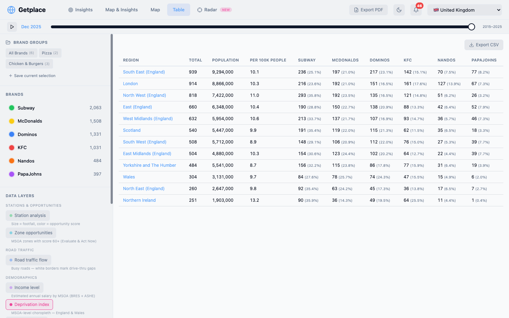

---

*Getplace • Insights Engine для QSR • Март 2026 • Внутренняя презентация*
